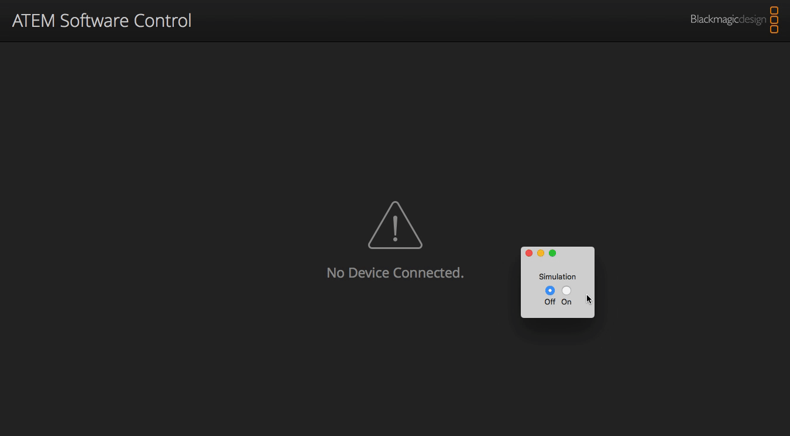

# Atem simulation tool

Simulates an ATEM Television Studio and enables the desktop application so you can peek around in the app and aren't stuck in the `No Device Connected` window.

This tool does not simulate the entire functionality of the Television studio but it keeps the connection alive so you can browse and discover the application...